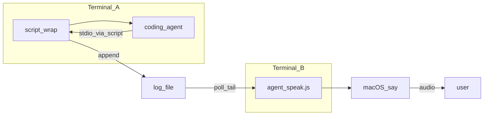

# エージェント出力読み上げツール「agent-speaker」要件

## 概要と目的

CLI タイプのコーディングエージェントは、ターミナル上で長文の標準出力を返すことがある。本ツールは、その出力を**ログファイルに集約**し、別プロセスでファイルを**監視しながら macOS の音声合成（`say`）で読み上げる**ことで、ユーザーが画面を見続けなくても進捗や結果を把握できるようにする。

## リポジトリ内のプロダクト

| 要素 | 説明 |
|---|---|
| 読み上げ CLI | Node.js 実装 [`scripts/agent_speak.js`](../../scripts/agent_speak.js)。npm スクリプト `npm run agent:speak` から起動する。 |
| ドキュメント | 本要件および [README.md](../../README.md)（インストール・利用例）。 |

本リポジトリのスコープは上記の単一 CLI とその周辺ドキュメントに限定する。

## 推奨する利用シナリオ

エージェント側の標準出力をファイルへ確実に書き出すため、macOS の `script(1)` でセッションを包む。読み上げは**別ターミナル**で本ツールを起動する。

1. **ログ記録（ターミナル A）**  
   `script -f -q -a "$filepath" your-agent-cli-command`  
   - `-f`: 書き込み後にフラッシュしやすくする。  
   - `-q`: 開始・終了メッセージを抑える。  
   - `-a`: 指定ログファイルへ追記する。  
   エージェントの**標準出力・標準エラー**は、`script` が収集するタイプセッションとして `$filepath` に記録される想定とする（個々のエージェントのリダイレクト仕様が異なる場合は、ユーザー側で同等の「全出力が一つのログに溜まる」形に合わせる）。

2. **読み上げ監視（ターミナル B）**  
   `npm run agent:speak -- "$filepath"`  
   ログへの追記を検知し、内容を音声で伝える。

必要に応じて音声やポーリング間隔を調整する（CLI オプションは後述）。

## 本文書の運用ルール

- 本規格書群は、エージェントによる開発の基盤となる要件定義である。開発はこの文書に則って進める。
- 開発を進める中で、新たに明らかになった事項（仕様の詳細化、技術的制約、設計判断など）は、本規格書群に適宜反映する。
- 要件に変更が必要になった場合（機能の追加・変更・削除、優先度の見直しなど）も、本規格書群を適宜更新する。
- 更新の際は、既存の記述との整合性を保ち、矛盾が生じないよう注意する。
- 本プロダクトは単一の Node CLI であるため、要件の変更は主に [`scripts/agent_speak.js`](../../scripts/agent_speak.js) の振る舞いと README の整合に収まる。

## システム構成

- **入力**: 単一のログファイルパス（起動時に絶対パスへ解決する）。
- **出力**: `say` による音声（標準出力での読み上げテキストの出力は要件としない）。

## 機能

### 必須

- **プラットフォーム判定**: 実行環境が macOS（`darwin`）でない場合、エラーメッセージを出して終了する。
- **ログファイルの待機**: 指定パスにファイルが存在しない場合、ポーリングで待機し、標準エラーに待機中であることを通知する。
- **増分読み取り**: ファイルサイズの変化を検知し、未読バイトだけを読み取る。
- **デフォルトは末尾追従**: 初回はファイルの**現在サイズをオフセット**とし、**それ以降に追記された内容のみ**を読み上げ対象とする。`--from-start` 指定時はファイル先頭から読む。
- **行単位の処理**: 読み取ったテキストは改行で行に分割する。最終行が改行で終わっていない場合は次の読み取りまでバッファする。バッファが一定長以上になったら読み上げに回す（実装上の上限はコードの `MAX_SPEAK_LENGTH` に準拠）。
- **読み上げ用テキストの正規化**  
  - OSC シーケンスおよび ANSI エスケープを除去する。  
  - 制御文字を除去する（改行は行分割の前処理で扱う）。  
  - キャリッジリターンやタブを適宜空白・改行に寄せる。
- **読み上げキュー**: `say` は非同期で完了するため、複数発話をキューに載せ、終了順に処理する。
- **長文の分割**: `say` へ渡す文字列は実装上の上限（現在 220 文字）を超えないよう単語境界を優先してチャンク化する。
- **連続重複の抑制**: 直前に読み上げた内容と同一の正規化後テキストは再度読み上げない。
- **ログのローテーション**: 同一パスで inode が変わった場合は新ファイルとみなし、先頭から読み直す。標準エラーにローテーションを通知する。
- **ログの切り詰め**: ファイルサイズが読み取りオフセットより小さくなった場合は切り詰めとみなし、先頭から読み直す。標準エラーに通知する。
- **Graceful shutdown**: SIGINT / SIGTERM でプロセスを終了できる。

### CLI

- **引数**: 監視するログファイルパスを 1 つだけ指定する。
- **オプション**  
  - `--help` / `-h`: 用法を表示して終了する。  
  - `--from-start`: ファイル先頭から読む。  
  - `--voice <name>`: `say -v` に渡す音声名。  
  - `--rate <wpm>`: `say -r` に渡す話速（正の整数）。  
  - `--poll-interval <ms>`: ポーリング間隔ミリ秒（正の整数）。デフォルトは実装上 400ms。
- **用法メッセージ**: 不正な引数・未知オプション時は標準エラーに理由を出し、用法を表示して非ゼロ終了する。

### 明示的な非スコープ（現仕様）

- GUI、設定ファイル、複数ファイル同時監視。
- Windows / Linux 向けの TTS（将来フェーズで検討する場合は別途要件化する）。

## 非機能要件

- **実行環境**: Node.js（具体的な LTS 範囲は [`package.json`](../../package.json) の `engines` を追加した際に本書と README を同期する。未定の間は README の記載を優先する）。
- **外部依存（OS）**: macOS に標準の `say` が利用可能であること。
- **レイテンシ**: 読み上げ開始までの遅れは主に `--poll-interval` と `say` の処理時間に依存する。既定ポーリングで実用上許容できることを目標とする。
- **信頼性**: 監視中の一時的な I/O 失敗は標準エラーに記録し、可能ならポーリングを継続する。
- **セキュリティ**: 本ツールはユーザーのローカルログを読むのみであり、ネットワーク送信やサニタイズ対象のマークアップは扱わない。ログ内容に機密が含まれる場合はユーザーの運用責任とする。

### クロスプラットフォームに関する記述

現行実装は **macOS のみ** を対象とする。Windows / Linux 向けに同等の読み上げを提供する場合は、TTS バックエンドの選定とともに別要件として追記する。

## テスト計画

### テスト方針

- **TDD（テスト駆動開発）を推奨する。** ただし `say` の実音声や端末依存の挙動は自動テストではモックまたは手動とする。
- テストピラミッドに従い、**純粋関数・引数解釈を単体テストで厚く**し、ファイル追従やプロセス起動は結合テストまたは手動で補う。
- **CI は現状の対象 OS に合わせ macOS を主とする。** Windows / Linux での TTS 対応を行うフェーズが始まった時点で、マトリクス要件を本書に追加する。
- セキュリティ特性は「ネットワークに送信しない・ログはローカル」の運用前提であり、サニタイズ製品のような攻撃面テストは対象外とする。
- CI/CD に組み込む場合は、プルリクエストごとに自動テストを実行する。

### TDD 開発プロセス

本プロジェクトでは、以下の Red-Green-Refactor サイクルに従って開発を進める。

1. **Red**: 期待する振る舞いを検証するテストを先に書き、失敗することを確認する。
2. **Green**: テストを通す最小限の実装をする。
3. **Refactor**: テストがすべてパスした状態を維持しつつ品質を改善する。

#### TDD の適用範囲

| 対象 | TDD 適用 | 備考 |
|---|---|---|
| テキスト正規化・空白折りたたみ・チャンク分割などの純粋関数 | 必須 | 抽出またはモジュール分割後、入力出力を表で固定する |
| 引数パース（ファイルパス・オプション・検証） | 必須 | エラーメッセージと終了コードの契約をテストで固定する |
| ファイル追従・inode 変化・切り詰め検知 | 推奨 | 一時ディレクトリとファイル操作で結合テストする |
| `say` の実起動・実音声 | 任意 | CI ではモック、リリース前に手動で音声確認する |

#### TDD 実践のルール

- 新機能実装時、対応する自動テストがない変更は原則マージしない（ドキュメントのみの変更等は除く）。
- バグ修正時は再現テストを先に書き、修正後にパスすることを確認する。
- テストコードも本番コードと同等の品質を維持する。
- 単体テストは個別に 1 秒以内、全体で数十秒以内を目安とする。

### テストレベル

#### 1. 単体テスト

- `normalizeForSpeech`、`collapseWhitespace`、`splitForSpeech` および同等の純粋処理。
- `parseArgs` に相当するオプション解釈（複数パスエラー、未知オプション、値欠落など）。

#### 2. 結合テスト

- 一時ログへの追記に応じた読み取りオフセット更新。
- ファイル作成待ちからの開始。
- 可能なら inode 変化・サイズ減少のシミュレーション（プラットフォームにより省略可）。

#### 3. E2E テスト

- 任意。実際の `say` を叩く E2E は CI で不安定になりやすいため、ローカルまたは macOS ランナー限定とする。

#### 4. セキュリティテスト

- 本ツールのスコープでは必須としない。ログに悪意のある制御シーケンスが混ざった場合の挙動は正規化テストで間接的に確認する。

#### 5. クロスプラットフォームテスト

- **現フェーズ**: macOS のみ。  
- **将来フェーズ**: Windows / Linux 対応時に CI マトリクスと手動確認項目を定義する。

#### 6. パフォーマンステスト

- リリース前に大きめのログで体感確認してよい。自動ベンチマークは任意。

#### 7. アクセシビリティテスト

- 音声の明瞭さ・話速は `--voice` / `--rate` とユーザー環境に依存する。必須の自動テストにはしない。

#### 8. 受け入れテスト

- README の手順どおりに `script` でログを取り、`npm run agent:speak` で追記が読み上げられることを確認する。

### テスト自動化方針

- 単体テスト・結合テスト: GitHub Actions 等で **macOS ランナー**上に Node をセットアップし、push / PR で実行する。
- E2E（実 `say`）: 任意。導入する場合は macOS のみに限定する。
- パフォーマンステスト: 原則手動。閾値付き自動化は将来検討。
- クロスプラットフォーム: 対応フェーズまで複数 OS マトリクスを必須とはしない。

### テストデータ

- サンプルログ（ANSI 付き・長行・ローテーション再現用など）をリポジトリの `sample/` 等で管理してよい。
- 機密を含む実ログはコミットしない。

### 品質基準

- 単体テスト・結合テストのコードカバレッジ: **抽出したロジックについて 80% 以上**を目標とする（CLI エントリ全体が一ファイルの間は、モジュール分割後に測定する）。
- 受け入れ: README の手順での macOS 上の動作確認をリリース前に実施する。
- クロスプラットフォーム: **現フェーズでは macOS のみパスをリリース条件とする。** 他 OS 対応時は本書を改訂する。
